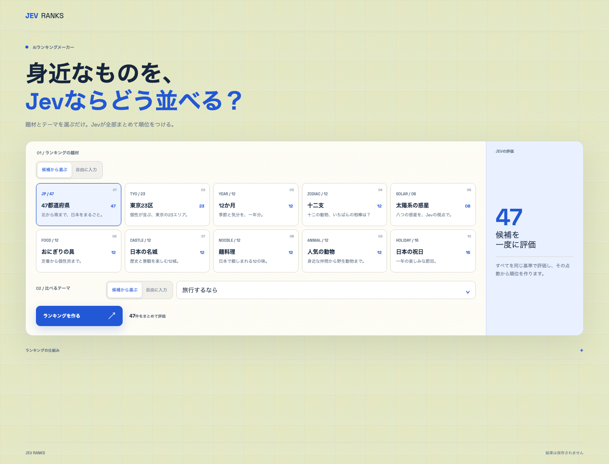

# Jev Ranks

身近な題材を、AI評価モデル「Jev」が同じ基準で採点して並べるランキングアプリです。プリセットから選ぶだけでなく、題材と評価テーマを自由に入力できます。



## 主な機能

- 10種類のプリセット題材
- 題材の自由入力（3〜30項目、各40文字まで）
- 評価テーマの自由入力（60文字まで）
- 全候補を1回のJevリクエストで5段階評価
- 同点を考慮したランキング表示
- スマートフォン対応とモーション軽減設定への対応

## 仕組み

```text
ブラウザ
  │ 題材・テーマのID、または検証済みの自由入力
  ▼
POST /api/rankings
  │ 入力検証とレート制限
  │ 全候補分の評価質問を生成
  ▼
TypeSafe AI Jev（1リクエスト）
  │ 回答形式・件数・スコア範囲を検証
  ▼
順位計算 → ブラウザへ返却
```

各候補は共通の5段階基準で独立して評価されます。画面では0〜4のスコアを0〜100点へ換算して表示します。この値は選択したテーマに対するJevの評価であり、確率、正解率、科学的事実を示すものではありません。同点には同じ順位を付けます。

## プリセット題材

| 題材 | 候補数 | 既定テーマ数 |
| --- | ---: | ---: |
| 47都道府県 | 47 | 6 |
| 東京23区 | 23 | 5 |
| 12か月 | 12 | 5 |
| 十二支 | 12 | 5 |
| 太陽系の惑星 | 8 | 5 |
| おにぎりの具 | 12 | 5 |
| 日本の名城 | 12 | 5 |
| 麺料理 | 12 | 5 |
| 人気の動物 | 12 | 5 |
| 日本の祝日 | 16 | 5 |

都道府県と東京23区の並びは公的なコード順、惑星は現在認められている8惑星に基づいています。参考：[e-Stat 市区町村名・コード](https://www.e-stat.go.jp/municipalities/cities/)、[NASA — About the Planets](https://science.nasa.gov/solar-system/planets/)。

## 技術構成

- Nuxt 4 / Vue 3 / TypeScript
- Vercel AI SDK 7 / TypeSafe AI Provider
- ZodによるAPI入力検証
- Upstash Redisによる本番レート制限
- Vitest / ESLint
- Vercel向けNitro構成

データベース、アカウント、アクセス解析は使用していません。ランキング結果もサーバーへ保存しません。

## ローカル開発

Node.js 22以上とpnpm 10以上が必要です。

```bash
pnpm install
cp .env.example .env
pnpm dev
```

`.env`に`TYPESAFE_AI_API_KEY`を設定すると、実際にランキングを生成できます。開発環境ではレート制限にプロセスメモリを使用します。

### 環境変数

| 変数 | 用途 | 必須環境 |
| --- | --- | --- |
| `TYPESAFE_AI_API_KEY` | Jevへの接続 | ランキング生成時 |
| `UPSTASH_REDIS_REST_URL` | Redisへの接続 | 本番 |
| `UPSTASH_REDIS_REST_TOKEN` | Redisの認証 | 本番 |

APIキーやRedis認証情報はクライアントへ公開されません。本番環境ではRedisが未設定または利用不能な場合、ランキングAPIを停止する安全側の動作になります。

## 品質確認

```bash
pnpm lint
pnpm typecheck
pnpm test
pnpm build
```

テストでは、入力改ざん、自由入力の境界値、Jevの不正な回答、同点順位、47候補を1回の評価へまとめる処理を確認しています。

## プライバシー

本番のレート制限では、接続元IPから生成したSHA-256ハッシュのみをRedisのカウンターキーとして使用します。自由入力を利用した場合、その題材とテーマは評価のためTypeSafe AIへ送信されます。リクエスト本文とランキング結果は保存しません。
